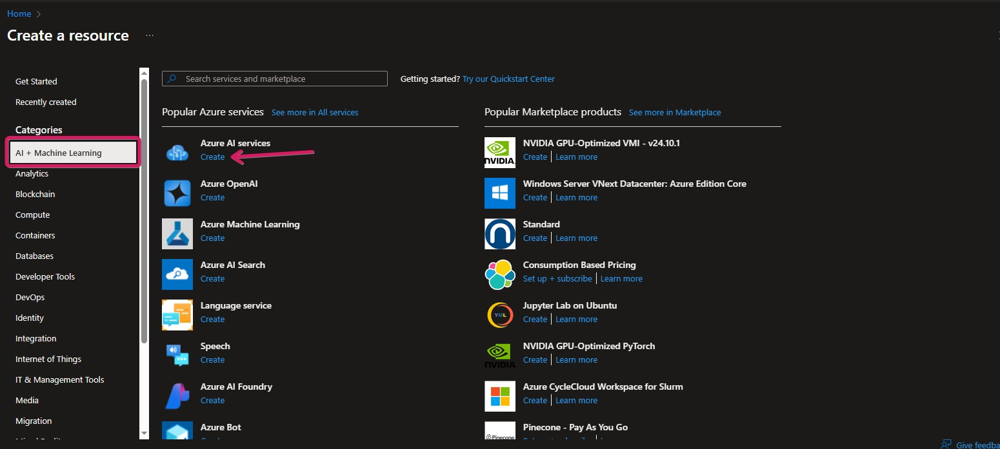
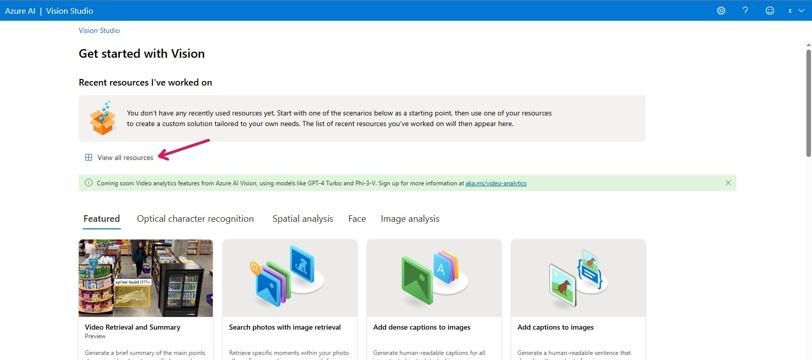
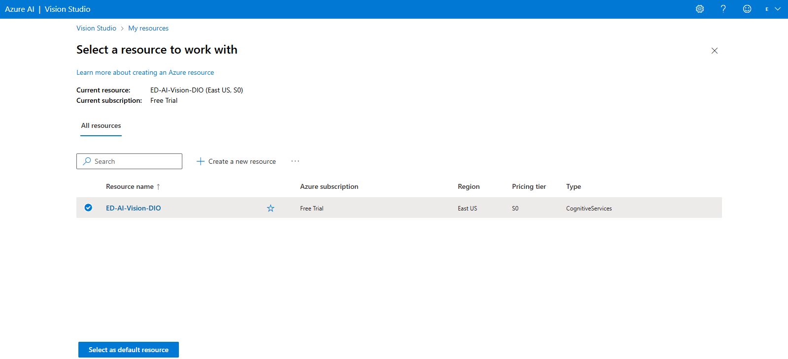
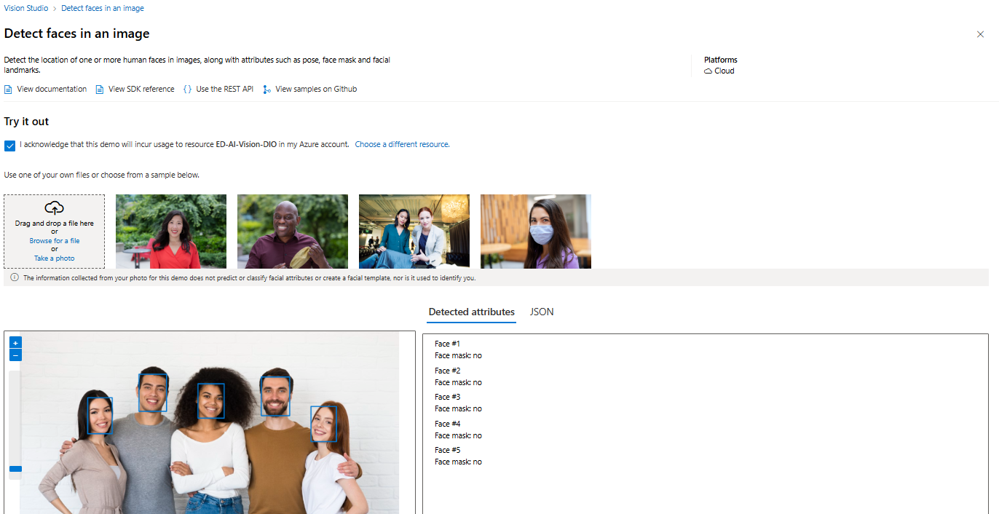
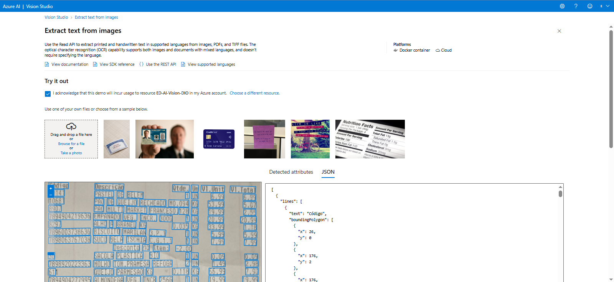
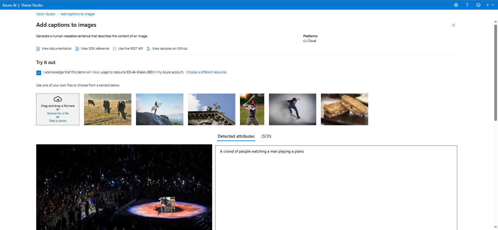

# Reconhecimento Facial e Transformação de Imagens em Dados no Azure ML
Este repositório busca documentar um teste feito dentro do Visual Studio utilizando Azure Machine Learning para identificação de rostos, textos e descrição de imagens e os passos executados.
  
## Passos Iniciais
Acesso ao Portal Azure (www.portal.azure.com);

Criação do Recurso

Acesso ao Portal MS Vision ([portal.vision.cognitive.azure.com](https://portal.vision.cognitive.azure.com/)) e exibição dos recursos

Seleção do recurso como padrão

## Detecção de Rostos
A ferramenta de detecção de rostos é bem utilizada e o código consegue delimitar bem os rostos. 
É uma tecnologia que pode ser utilizada, em maior escala, em bancos de fotos para identificar e agrupar rostos e, em menor escala, como validador de dados, a fim de verificar se uma foto adicionada pelo usuário possui o rosto visível.

No exemplo foi utilizado uma foto (licença gratuita - https://br.freepik.com/fotos-vetores-gratis/5-pessoas) para detecção dos rostos.

A seguir está a [foto base](inputs/FACE-input.jpg) e a [resposta](outputs/FACE-output.json) em JSON.

## Leitura de Texto em Imagens (OCR)
A extração de texto a partir de imagem possui grandes usos, como leitura automática de placas de carros em um estacionamento, extração de textos em manuscritos antigos, digitalização de grande volume de texto de forma ágil, entre outros.

No exemplo, foi utilizado uma foto de parte de um cupom fiscal. Um uso seria uma aplicação em que se tira uma foto do cupom fiscal e esses dados são inseridos no banco de dados para usos diversos.

A seguir está a [foto base](inputs/OCR-input.jpg) e a [resposta](outputs/OCR-output.json) em JSON.

## Descrição de Imagens
A descrição de imagens cumpre principalmente um papel social importante, sendo uma ferramenta que pode trazer mais acessibilidade para cegos e deficientes visuais.
Pode ser utilizado também para geração de palavras chave otimizadas para SEO, entre outros usos.

No exemplo, foi utilizado uma foto de um show em que a performance acontece no centro, em um piano, e o publico se encontra no entorno.

A seguir está a [foto base](inputs/CAPTION-input.jpg) (G1 - [Lady Gaga no Rio: veja FOTOS do show](https://g1.globo.com/rj/rio-de-janeiro/show-da-lady-gaga/noticia/2025/05/03/show-de-lady-gaga-fotos.ghtml)) e a [resposta](outputs/CAPTION-output.json) em JSON.

Apesar de ser bem acurado, o serviço ainda precisa se livrar de alguns vieses pois rodei a mesma foto 4 vezes e, em todas, obtive prompts semelhantes:
* *a crowd of people watching a man playing a piano* (uma multidão de pessoas assistindo a um homem tocar um piano - tradução livre)
* *a man playing a piano on a stage with a crowd of people* (um homem tocando piano em um palco com uma multidão de pessoas - tradução livre).

Entretanto, sem o contexto adequado e dada a qualidade da imagem, não é possível afirmar que a pessoa na foto é um homem ou uma mulher.
Sendo assim, creio que a abordagem mais adequada seria sugerir que há uma pessoa (neutro).
Isso leva a pensar quais rotas e arredondamentos o algoritmo fez para chegar a essa conclusão e, dado ao volume de dados analisados, quais outros impactos poderiam seriam observados com essa postura.  